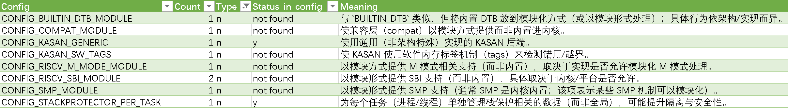
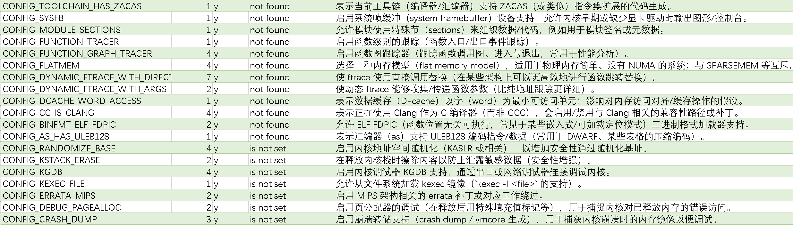
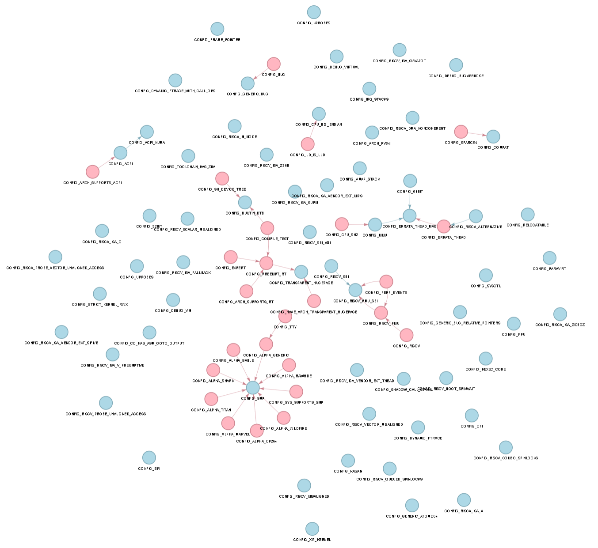

应该设置成y->Y；应该设置成n->N；两者都有->all；两者都有，但Y管理的多->allY；两者都有，但N管理的多->allN。

# 分析CONFIG清单

## 1 建议值为n

以module结尾的config表示该config在代码中会被判断该config是否以m/y方式被编译，如果是，则启用/不启用某些代码。经过验证，这些以module结尾的config，都被建议为all，所以这些在第三节all里面分析。

### 1-1 CONFIG_KASAN_GENRIC, CONFIG_KASAN_SW_TAGS

#### 1-1-1 kasan

为了使能kasan，需要CONFIG_KASAN=y，然后从CONFIG_KASAN_GENRIC, CONFIG_KASAN_SW_TAGS, CONFIG_KASAN_HW_TAGS三个里面选择一个为y。而软硬件标签型kasan都是arm64 only的，所以在risc-v上只能用CONFIG_KASAN_GENRIC。

#### 1-1-2 arch/riscv

在arch/riscv下有汇编实现的strcmp, strlen等函数，这些函数会在CONFIG_KASAN_GENRIC和CONFIG_KASAN_SW_TAGS为n时被编译进内核。GENRIC和SW_TAGS被设置为n，而HW_TAGS是arm64特有的，所以想要测试这些汇编代码编写的函数，就无法开启kasan。这是矛盾的。

### 1-2 CONFIG_STACKPROTECTOR_PER_TASK

N

栈保护是一种防御机制，用于防止栈溢出攻击，编译器会在函数返回前检查一个特殊的变量是否被篡改。通常情况下，这个变量是全局的，即所有task共享一个。当CONFIG_STACKPROTECTOR_PER_TASK开启后，相当于每个task都有一个自己的变量。

在arch/riscv下，需要关闭CONFIG_STACKPROTECTOR_PER_TASK，这样能测试到更多的代码(全局变量的定义和使用)。如果是开启的话，这段代码不会被测试，每个task自己的变量定义和使用不在arch/riscv下。

## 2 建议值为y

### 2-1 CONFIG_RANDOMIZE_BASE

Y

启用时，内核在启动时会在虚拟地址空间随机化内存映像的加载基址，增强安全性。

### 2-2 CONFIG_KSTACK_ERASE

Y

在系统调用返回前清空内核栈，防止敏感信息残留在栈中。

### 2-3 CONFIG_KGDB

Y

启动内核调试器支持。

### 2-4 CONFIG_KEXEC_FILE

Y

允许从文件系统加载kexec镜像。

### 2-5 CONFIG_ERRATA_MIPS

Y

启用MIPS架构相关的errata补丁。

### 2-6 CONFIG_DEBUG_PAGEALLOC

Y

启用页分配器的调试，用于捕捉内核对已释放内存的错误访问。

### 2-7 CONFIG_CRASH_DUMP

Y

启用崩溃转储支持，用于捕获内核崩溃时的内存镜像以便调试。

### 2-8 其他

这些都是在现有config清单中not found的，通过menuconfig一一打开即可。

CONFIG_TOOLCHAIN_HAS_ZACAS, CONFIG_RISCV_ISA_ZABHS, CONFIG_SYSFB, CONFIG_MODULE_SECTIONS, CONFIG_FUNCTION_TRACER, CONFIG_FUNCTION_GRAPH_TRACER, CONFIG_FLATMEM, CONFIG_DYNAMIC_FTRACE_WITH_DIRECT_CALLS, CONFIG_DYNAMIC_FTRACE_WITH_ARGS, CONFIG_DCACHE_WORD_ACCESS, CONFIG_CC_IS_CLANG, CONFIG_BINFMT_ELF_FDPIC, CONFIG_AS_HAS_ULEB128

## 3 建议值为all

### 3-1 CONFIG_COMPAT

allY

在64位内核中开启对32位用户态程序的兼容支持。通过看源码，发现CONFIG_COMPAT被设置成y/m和n时管理了不同的代码，前者管理的代码更多，后者也有，但是很少(不到十行)，所以这里应该打开它。

### 3-2 CONFIG_RISCV_M_MODE

all

是否构建一个运行在RISC-V M模式下的内核，正常情况下Linux运行在S mode。这个配置项的开启需要CONFIG_MMU为n。

### 3-3 其他

这类建议值为all的config，理想情况下只需要两个config清单(一个全为y，一个全为n)，最差需要2的63次方个。需要看哪些是没有依赖关系的。

下面这个图蓝色的是要处理的config。可以看到大多数config之间都是没有依赖关系的，所以最终可能只需要5~6个配置项清单就够了（依赖关系有两种，即A为N，B才能为Y；A为Y，B才能为Y）。

