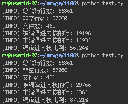

# Score config

需要一个程序，能够给一个.config打分，看其能覆盖arch/riscv下的多少代码。

这个程序需要做三件事情：

* 读arch/riscv下的.S, .c, .h文件，分析出哪个文件的哪些行被哪些配置项管理；
* 读.config文件，分析出定义了哪些配置项以及该配置项被设置的值是多少；
* 打分，对于每一个被配置项管理的file:line而言，看值是否被满足。

输出：arch/riscv下共有多少代码行，有多少代码行被配置项管理，当前.config能让多少代码行被编译进内核。

## 1 统计.c, .S, .h的代码行数

统计 `arch/riscv/` 下所有 `.c`、`.S`、`.h` 文件的代码行数 。

这个模块的目标是：

* 递归遍历 `arch/riscv/`
* 只统计后缀为 `.c`, `.S`, `.h` 的文件
* 计算总行数（可以区分空行 / 非空行）

```shell
import os

def count_source_lines(root="arch/riscv"):
    exts = {".c", ".S", ".h"}
    total_lines = 0
    total_nonempty_lines = 0
    file_line_counts = {}

    for dirpath, _, filenames in os.walk(root):
        for f in filenames:
            _, ext = os.path.splitext(f)
            if ext not in exts:
                continue

            path = os.path.join(dirpath, f)
            try:
                with open(path, "r", encoding="utf-8", errors="ignore") as fp:
                    lines = fp.readlines()
            except Exception as e:
                print(f"[WARN] 无法读取文件 {path}: {e}")
                continue

            n_lines = len(lines)
            n_nonempty = sum(1 for l in lines if l.strip())
            file_line_counts[path] = (n_lines, n_nonempty)
            total_lines += n_lines
            total_nonempty_lines += n_nonempty

    return total_lines, total_nonempty_lines, file_line_counts

if __name__ == "__main__":
    total, nonempty, detail = count_source_lines("/home/rv/mrvga/linux-6.18-rc3/arch/riscv")
    print(f"总代码行数: {total}")
    print(f"非空行数: {nonempty}")
    print(f"文件数: {len(detail)}")

总代码行数: 65151
非空行数: 55337
文件数: 396
```

## 2 分析undertaker -j blockconf path:line的输出结果

对于arch/riscv目录下的每个.c, .S, .h文件的每一行都调用undertaker的blockconf功能，筛选出非#开头的行(叫做CONFIGS))，形成从path:line->CONFIGS的映射。

```python
import os
import subprocess
import multiprocessing
import csv

def run_undertaker_for_line(args):
    """调用 undertaker -j blockconf 并返回非#行输出"""
    filepath, line = args
    cmd = ["undertaker", "-j", "blockconf", f"{filepath}:{line}"]
    try:
        output = subprocess.check_output(cmd, stderr=subprocess.DEVNULL)
        out_lines = output.decode("utf-8").splitlines()
        # 过滤掉全部以 # 开头的行
        meaningful_lines = [l for l in out_lines if l.strip() and not l.strip().startswith("#")]
        if meaningful_lines:
            return f"{filepath}:{line}", meaningful_lines
    except subprocess.CalledProcessError:
        pass
    return None

def analyze_riscv_arch(root="arch/riscv", nprocs=8, csv_file="fileline_output.csv"):
    """
    对 arch/riscv 下的每一行调用 undertaker -j blockconf，生成映射。
    返回:
        fileline_to_output: {FILE:LINE : tuple(output_lines)}
    """
    # --- 收集文件行数 ---
    exts = {".c", ".S", ".h"}
    file_line_counts = {}
    for dirpath, _, filenames in os.walk(root):
        for f in filenames:
            _, ext = os.path.splitext(f)
            if ext not in exts:
                continue
            path = os.path.join(dirpath, f)
            try:
                with open(path, "r", encoding="utf-8", errors="ignore") as fp:
                    n_lines = sum(1 for _ in fp)
            except Exception as e:
                print(f"[WARN] 无法读取文件 {path}: {e}")
                continue
            file_line_counts[path] = n_lines

    # --- 构建任务列表 ---
    tasks = [(fp, i) for fp, n in file_line_counts.items() for i in range(1, n+1)]

    # --- 多进程调用 undertaker ---
    fileline_to_output = {}  # FILE:LINE -> [output_line1, ...]
    with multiprocessing.Pool(processes=nprocs) as pool:
        for res in pool.imap_unordered(run_undertaker_for_line, tasks):
            if res:
                file_line, meaningful_lines = res
                # === 对 output_lines 进行过滤与修正 ===
                processed_lines = []
                for line in meaningful_lines:
                    line = line.strip()
                    if line.endswith("_MODULE=n"):
                        continue  # 跳过 _MODULE=n
                    if line.endswith("=m"):
                        line = line[:-2] + "=y"  # 替换 =m → =y
                    processed_lines.append(line)

                if not processed_lines:
                    continue
                # === 路径归一化：去掉绝对路径前缀 ===
                if root.endswith("/"):
                    rel_root = root
                else:
                    rel_root = root + "/"
                if file_line.startswith(rel_root):
                    file_line = file_line.replace(rel_root, "arch/riscv/", 1) 

                fileline_to_output[file_line] = tuple(processed_lines)

    # --- 写 FILE:LINE -> output_lines CSV ---
    with open(csv_file, "w", newline="", encoding="utf-8") as f:
        writer = csv.writer(f)
        writer.writerow(["file_line", "output_lines"])
        for fl, lines in fileline_to_output.items():
            writer.writerow([fl, ";".join(lines)])

    print(f"[INFO] FILE:LINE -> output_lines CSV 写入 {csv_file}")

    return fileline_to_output

if __name__ == "__main__":
    mapping = analyze_riscv_arch(
        root="/home/rv/mrvga/linux-6.18-rc3/arch/riscv",
        nprocs=80,
        csv_file="fileline_output.csv"
    )
    print(f"[INFO] 总共有 {len(mapping)} 个行被配置项管理。")

[INFO] FILE:LINE -> output_lines CSV 写入 fileline_output.csv
[INFO] 总共有 13288 个行被配置项管理。
```

## 3 分析path:line是否被编进内核

前面分析得到了fileline_to_output，对于每个每个fileline，需要去看其output在.config中是否被满足：

```python
import csv
import re

def parse_config_file(config_path):
    """解析 .config 文件，返回 {CONFIG_KEY: value}"""
    config_map = {}
    with open(config_path, "r", encoding="utf-8", errors="ignore") as f:
        for line in f:
            line = line.strip()
            if not line or line.startswith("#"):
                # 处理 "# CONFIG_X is not set"
                m = re.match(r"#\s*(CONFIG_[A-Za-z0-9_]+)\s+is\s+not\s+set", line)
                if m:
                    config_map[m.group(1)] = "n"
                continue
            if "=" in line:
                k, v = line.split("=", 1)
                config_map[k.strip()] = v.strip()
    return config_map


def evaluate_compilation(fileline_to_output, config_path, csv_compiled, csv_skipped):
    """
    判断哪些行被编译进内核。
    输入:
        fileline_to_output: {file:line -> [CONFIG_*=y/n/...]}
        config_path: .config 文件路径
    输出:
        csv_compiled: 被编译进内核的行
        csv_skipped: 未被编译进内核的行
    """
    config_map = parse_config_file(config_path)
    compiled = []
    skipped = []

    for fileline, configs in fileline_to_output.items():
        conditions = []
        for cfg in configs:
            if "=" in cfg:
                k, v = cfg.split("=", 1)
                conditions.append((k.strip(), v.strip()))

        all_ok = True
        unmet = []
        for k, expected in conditions:
            actual = config_map.get(k, "n")  # 未定义的 CONFIG 视作 n
            if actual != expected:
                all_ok = False
                unmet.append(f"{k}={actual} (need {expected})")

        if all_ok:
            compiled.append((fileline, ";".join(configs)))
        else:
            skipped.append((fileline, ";".join(configs), ";".join(unmet)))

    # --- 写 CSV ---
    with open(csv_compiled, "w", newline="", encoding="utf-8") as f:
        w = csv.writer(f)
        w.writerow(["file_line", "output_lines"])
        for row in compiled:
            w.writerow(row)

    with open(csv_skipped, "w", newline="", encoding="utf-8") as f:
        w = csv.writer(f)
        w.writerow(["file_line", "output_lines", "unmet_conditions"])
        for row in skipped:
            w.writerow(row)

    print(f"[INFO] 被编译进内核的行: {len(compiled)}")
    print(f"[INFO] 未编译进内核的行: {len(skipped)}")
    total = len(compiled) + len(skipped)
    if total:
        ratio = len(compiled) / total * 100
        print(f"[INFO] 编译进内核比例: {ratio:.2f}%")

    return compiled, skipped

if __name__ == "__main__":
    mapping = analyze_riscv_arch(
        root="/home/rv/mrvga/linux-6.18-rc3/arch/riscv",
        nprocs=80,
        csv_file="fileline_output.csv"
    )

    compiled, skipped = evaluate_compilation(
        fileline_to_output=mapping,
        config_path="/home/rv/mrvga/syzkaller-config",
        csv_compiled="compiled_lines.csv",
        csv_skipped="skipped_lines.csv"
    )

# 对于syzbot提供的和优化后的config作比较
rv@userid-07:~/mrvga/1106$ python test.py 
[INFO] FILE:LINE -> output_lines CSV 写入 fileline_output.csv
[INFO] 被编译进内核的行: 11420
[INFO] 未编译进内核的行: 1868
[INFO] 编译进内核比例: 85.94%
rv@userid-07:~/mrvga/1106$ python test.py 
[INFO] FILE:LINE -> output_lines CSV 写入 fileline_output.csv
[INFO] 被编译进内核的行: 10523
[INFO] 未编译进内核的行: 2765
[INFO] 编译进内核比例: 79.19%
```

## 4 makefile/kbuild对文件的影响

有的配置项是在makefile/kbuild中直接控制某个文件是否被编进内核，而这是undertaker无法处理的。所以需要借助[kbuildparser](https://github.com/6eanut/kbuildparser)。

```python
import subprocess
import os
import re

def update_mapping_from_kbuildparser_live(fileline_to_output, root="arch/riscv", debug_file="kbuildparser_debug.log"):
    """
    调用 kbuildparser -a riscv，解析输出并更新 fileline_to_output。
    增加调试信息，写入 debug_file。
    """
    updated_mapping = fileline_to_output.copy()

    with open(debug_file, "w", encoding="utf-8") as debug:
        debug.write(f"[INFO] 调用 kbuildparser 在 {root}\n")

        # 执行 kbuildparser
        try:
            result = subprocess.run(
                ["kbuildparser", "-a", "riscv"],
                cwd=root,
                stdout=subprocess.PIPE,
                stderr=subprocess.DEVNULL,
                text=True,
                check=True
            )
            kbuild_lines = result.stdout.splitlines()
            debug.write(f"[INFO] kbuildparser 输出共 {len(kbuild_lines)} 行\n")
            debug.write("[INFO] 原始输出开始:\n")
            for l in kbuild_lines:
                debug.write(l + "\n")
            debug.write("[INFO] 原始输出结束\n\n")
        except subprocess.CalledProcessError as e:
            debug.write(f"[WARN] kbuildparser 执行失败: {e}\n")
            return updated_mapping

        def parse_kbuild_line(line):
            """解析 kbuildparser 输出行为 (filepath, [(CONFIG_KEY, value), ...])"""
            if "<-" not in line:
                return line.strip(), []
            path, cond = line.split("<-", 1)
            path = path.strip()
            cond = cond.strip()
            configs = []
            for token in re.split(r"\s*&&\s*", cond):
                token = token.strip()
                if token.startswith("!"):
                    configs.append((token[1:], "n"))
                else:
                    configs.append((token, "y"))
            return path, configs

        # 遍历 kbuildparser 输出
        for line in kbuild_lines:
            line = line.strip()
            if not line or line.startswith("#"):
                continue
            filepath, configs = parse_kbuild_line(line)
            debug.write(f"[DEBUG] 解析行: '{line}' -> 文件: {filepath}, 配置: {configs}\n")
            if not configs:
                continue

            # 获取文件所有行
            file_lines = [k for k in updated_mapping if k.startswith(filepath + ":")]
            if not file_lines:
                # mapping 中没有文件，尝试读取文件生成每行 key
                try:
                    with open(os.path.join(root, filepath), "r", encoding="utf-8", errors="ignore") as f:
                        n_lines = sum(1 for _ in f)
                    file_lines = [f"{filepath}:{i}" for i in range(1, n_lines + 1)]
                    debug.write(f"[DEBUG] 文件 {filepath} 不在 mapping 中，读取文件行数 {n_lines}\n")
                except Exception:
                    debug.write(f"[WARN] 无法读取文件 {filepath}，跳过\n")
                    continue

            # 更新 mapping
            for fl in file_lines:
                existing = list(updated_mapping.get(fl, ()))
                added = []
                for cfg, val in configs:
                    entry = f"{cfg}={val}"
                    if entry not in existing:
                        existing.append(entry)
                        added.append(entry)
                updated_mapping[fl] = tuple(existing)
                if added:
                    debug.write(f"[INFO] 更新 {fl} -> 新增配置: {added}\n")

        debug.write(f"\n[INFO] 总共更新了 {len(updated_mapping)} 个行条目\n")

    return updated_mapping
```

## 5 效果



```shell
rv@userid-07:~/mrvga/1106$ python test.py 
[INFO] 总代码行数: 66861
[INFO] 非空行数: 57030
[INFO] 文件数: 461
[INFO] 被编译进内核的行: 11220
[INFO] 未编译进内核的行: 2085
[INFO] 编译进内核比例: 84.33%
rv@userid-07:~/mrvga/1106$ python test.py 
[INFO] 总代码行数: 66861
[INFO] 非空行数: 57030
[INFO] 文件数: 461
[INFO] 被编译进内核的行: 9596
[INFO] 未编译进内核的行: 3709
[INFO] 编译进内核比例: 72.12%
```
